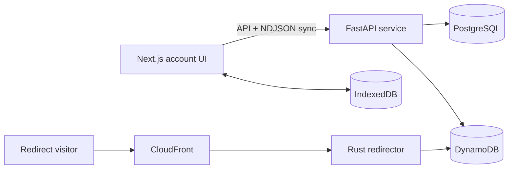

# aoi.rs

**A local-first account application and high-volume URL shortener, designed around different data and scaling requirements for management traffic and redirects.**

Aoi lets users sign in with one-time email codes, manage sessions and scoped personal access tokens, create permanent short links, and resolve those links through a cache-friendly redirect path. The repository separates relational identity data from high-volume link storage, gives the browser a durable local replica of account state, and isolates latency-sensitive redirects from the control-plane API.

## Engineering highlights

- **Local-first account state:** the web client streams a snapshot or revision-based deltas into IndexedDB, then exposes observable MobX models.
- **Durable client mutations:** edits are persisted before execution, coalesced per resource, serialized across browser contexts with Web Locks, and resumed after reload.
- **Purpose-built persistence:** PostgreSQL owns relational identity and security state. DynamoDB owns short links and distributed slug allocation. IndexedDB owns the browser replica and pending work.
- **Separate control and redirect planes:** FastAPI handles authenticated management operations, while a small Rust/Axum service resolves slugs directly from DynamoDB.
- **Immutable redirects:** destinations cannot change or be deleted, allowing HTTP 308 responses to be cached at CloudFront for one year without invalidation.
- **Production-shaped delivery:** Terraform describes Vercel, CloudFront, ALBs, ECS/Fargate, RDS, DynamoDB, TLS/DNS, IAM, ECR, and CloudWatch.

## Architecture at a glance



The management side favors correctness, authorization, and relational state. The redirect side has a narrower contract—`slug -> destination`—and scales and caches independently. The browser replica covers the profile, sessions, and personal access tokens; links currently use the API directly.

Read the [architecture overview](docs/architecture.md), [sync engine](docs/sync-engine.md), [transaction system](docs/transaction-system.md), [data model](docs/data-model.md), and [deployment architecture](docs/deployment.md).

## Technology

| Area | Technology |
| --- | --- |
| Web | Next.js 16, React 19, TypeScript, MobX, Dexie/IndexedDB |
| API | Python 3.14, FastAPI, Pydantic, SQLAlchemy, Alembic |
| Redirector | Rust, Axum, Tokio, AWS SDK |
| Data | PostgreSQL, DynamoDB, IndexedDB |
| Infrastructure | Terraform, ECS/Fargate, ALB, CloudFront, RDS, ECR, Vercel |
| Tooling | Bun, Turborepo, uv, Ruff, Pyright, Biome, GitHub Actions |

## Repository layout

```text
clients/
  apps/www/          Next.js account application
  packages/local/    IndexedDB replica, MobX models, sync and transactions
server/              FastAPI control-plane API and PostgreSQL migrations
crates/redirector/   Rust redirect data plane
terraform/           Global and production infrastructure
```

## Local development

Prerequisites: Bun, uv, Python 3.14, Rust, Docker, and Docker Compose.

```sh
# Data services and API
cd server
cp .env.template .env
docker compose up -d
uv sync --dev --frozen
uv run task db_migrate
uv run task service
```

In another terminal:

```sh
cd clients
bun install
NEXT_PUBLIC_API_BASE_URL=http://127.0.0.1:8000 bun run dev
```

The development email sender logs one-time login codes. To run the redirector against DynamoDB Local, copy `crates/redirector/.env.template`, provide `AWS_ENDPOINT_URL_DYNAMODB`, and create the `links` and `counters` tables represented in `terraform/production/dynamodb.tf`.

## Checks

```sh
cd server && uv run task lint && uv run task type_check
cd clients && bun run lint && bun run typecheck && bun run build
cd crates/redirector && cargo check
cd terraform/production && terraform validate
```

## Design scope

The deeper documents distinguish intended architecture from current implementation gaps. In particular, revisions are documented as the logical ordering contract required by synchronization. The current PostgreSQL sequence allocator is scheduled for replacement because allocation order and transaction commit order can diverge under concurrency.
