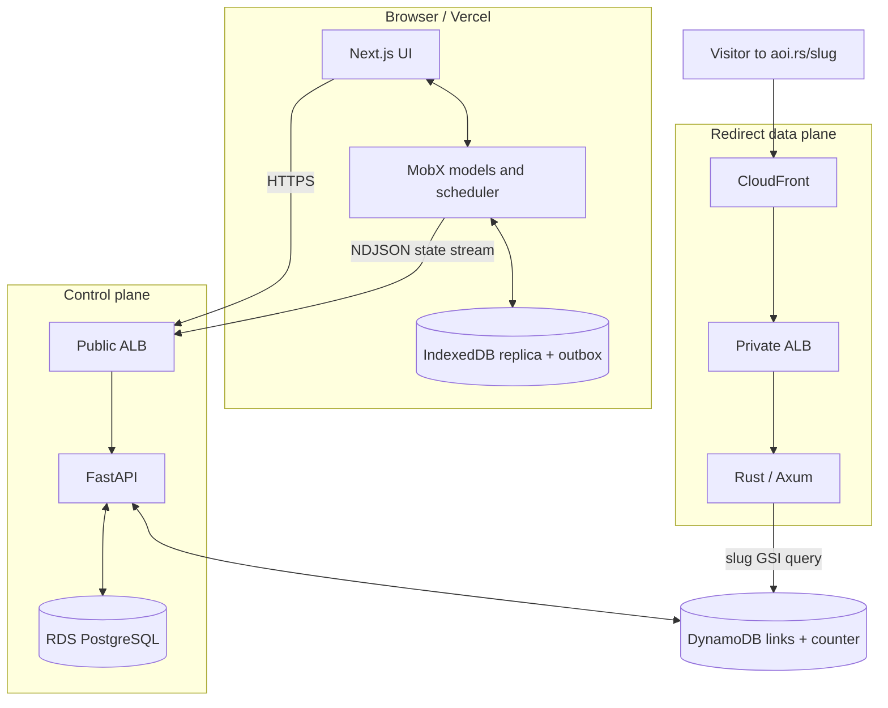

# Architecture

Aoi separates workloads by consistency model and access pattern instead of forcing every request through one application and datastore.

- The **Next.js account application** renders the authenticated UI and hosts the browser replica.
- The **FastAPI service** is the control plane for authentication, account management, link creation, and synchronization.
- **PostgreSQL** stores relational identity and security state.
- **DynamoDB** stores the much larger short-link dataset and the slug-allocation counter.
- The **Rust redirector** is a narrow data plane that looks up a destination and returns an immutable redirect.
- **CloudFront** turns those redirects into edge-cached responses.

## Boundaries and data flow

## Management requests

`account.aoi.rs` is hosted by Vercel and calls `service.aoi.rs`. FastAPI authenticates either HTTP-only session cookies or a bearer personal access token, then applies resource-specific permissions. SQLAlchemy repositories scope relational reads to the account; link requests cross the same authorization boundary but use DynamoDB.

Authentication is passwordless. A short-lived, hashed email code creates the user if necessary and establishes a session. The server issues an hour-long access JWT and a rotating refresh token. Session refresh uses a PostgreSQL row lock and short retry loop so concurrent tabs do not occupy the connection pool while waiting. A narrow reuse window tolerates concurrent tabs and responses the client failed to save; unexpected reuse can invalidate the session.

Most endpoints follow router → service → repository boundaries. Routers define transport contracts, services implement workflows, repositories encode queries, and schemas keep public representations separate from stored secrets. Pydantic/OpenAPI is the API contract source, and the web app generates TypeScript types from it.

## Local-first account state

At startup, the browser asks `/v1/state/` for a complete account snapshot or changes after its last revision. NDJSON records are applied incrementally to IndexedDB. The app then loads pending local operations, overlays their intended values where supported, and materializes MobX models for React.

IndexedDB is the immediate source for replicated account reads; PostgreSQL remains authoritative. The reusable `@aoi-rs/local` package owns replication and mutation policy rather than distributing it across components. The current replica includes profile, sessions, and personal access tokens; link management uses the API directly. See [Sync engine](sync-engine.md) and [Transaction system](transaction-system.md).

## Link creation and redirect resolution

Creating a link crosses the control plane once:

1. FastAPI authorizes the account.
2. A process-local allocator reserves 100 numbers with an atomic DynamoDB counter update.
3. The next number is Base62-encoded into a compact slug.
4. A UUIDv7 identifies and chronologically orders the link in its owner's partition.
5. A conditional write prevents accidental replacement.

Range allocation reduces counter contention and network calls. Process failure may leave gaps, but uniqueness—not density—is the invariant.

Redirect traffic follows a shorter path. Rust queries the slug global secondary index, projects only the destination, and returns `308 Permanent Redirect` with `Cache-Control: public, max-age=31536000, immutable`. Because destinations cannot be edited or deleted, CloudFront does not need invalidation. That business rule is what makes the cache policy safe.

## Why PostgreSQL and DynamoDB?

PostgreSQL fits users, sessions, login tokens, and personal access tokens because they have relational ownership, transactional authentication flows, updates, expiry, and deletion semantics.

DynamoDB fits links because the required queries are fixed and high-volume: list an owner's links in chronological order, retrieve by owner and ID, resolve a globally unique slug, and atomically reserve slug numbers. The owner UUID partition key and UUIDv7 sort key support cursor pagination without scans; a slug GSI supports the redirect path. Compact item attributes reduce storage overhead at the projected scale.

The tradeoff is a deliberate cross-store boundary: link writes are not transactionally coupled to PostgreSQL. Ownership is denormalized into the DynamoDB key and enforced by building management keys from the authenticated account.

## Consistency boundaries

- PostgreSQL transactions are authoritative for account state; revision metadata advances browser replicas.
- DynamoDB conditional and atomic updates protect link creation and counter allocation.
- IndexedDB persists local intent independently of the network. A successful request removes it; a later refresh supplies the canonical server record.
- CloudFront can serve a redirect for a year because the origin result is immutable.

See [Data model](data-model.md) for representations and [Deployment](deployment.md) for production routing.
