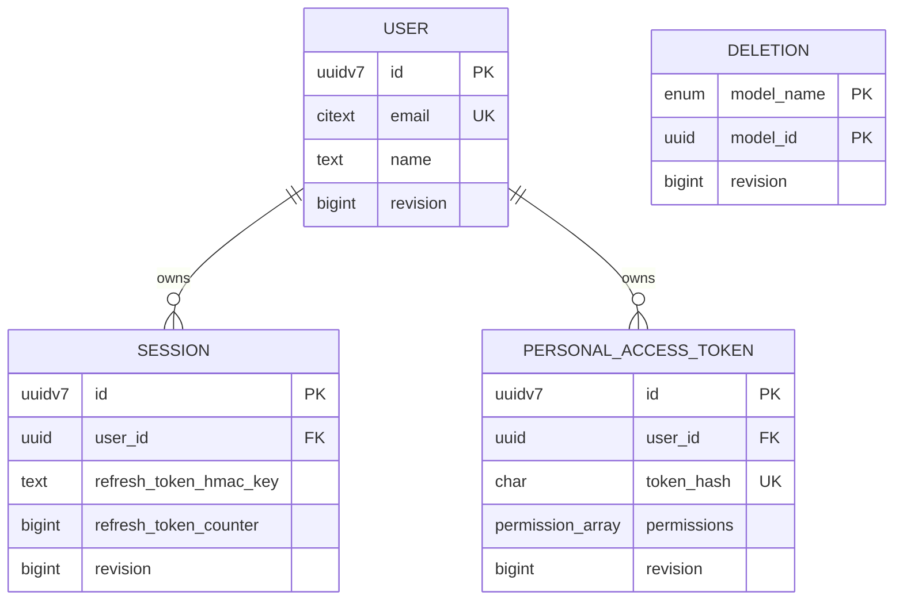

# Data model

Aoi uses three stores because its data has three shapes: transactional account state, very large key-addressed link state, and a browser-local replica with an outbox.

## PostgreSQL: identity and account state

Login tokens are also relational records, storing an email, keyed token hash, expiry, and one-use flag. Raw login codes and personal access tokens are not stored as reusable credentials. Sessions keep an HMAC key and increasing refresh counter so rotation and reuse detection can be enforced under a row lock.

Users, sessions, and personal access tokens carry revisions for the sync feed. Revisions are ordering metadata, not business identifiers. Deleting a session or token invokes a PostgreSQL trigger that records a tombstone, preserving a change that would otherwise disappear with the row.

PostgreSQL is appropriate here because login and refresh need transactions, row locking, uniqueness, foreign-key ownership, cascades, and security-sensitive updates. Case-insensitive `CITEXT` email uniqueness is enforced in the database.

## DynamoDB: links and slug allocation

| Attribute | Meaning | Key role |
| --- | --- | --- |
| `u` | Owner UUID bytes | Partition key |
| `i` | Link UUIDv7 bytes | Sort key |
| `s` | Base62 slug | `link_destinations` GSI partition key |
| `d` | Destination URL | Projected into the slug GSI |
| `n` | Optional user label | Non-key attribute |

The primary key supports bounded owner queries and UUIDv7 cursor pagination. UUID bytes preserve chronological ordering, and creation time is recovered from the UUID. The GSI resolves a slug with one query and projects the destination, avoiding a second table read.

Destination and slug are immutable, and links have no delete operation. Only the account-facing label can change. This removes cache invalidation and dangling-slug semantics from redirects.

The `counters` table contains a global number. API processes atomically add 100, dispense the reserved range locally, and Base62-encode each value. Reserving ranges trades gap-free allocation for fewer coordinated writes; gaps after a crash are acceptable.

## IndexedDB: replica and outbox

| Table | Key/index | Purpose |
| --- | --- | --- |
| `_meta` | `id` | `last_revision` under the `meta` key |
| `_transactions` | auto `id`; `[model_class+model_id]` | Durable mutation outbox |
| `users` | `id` | Profile, locally keyed as `@me` |
| `sessions` | `id` | Replicated sessions |
| `personal_access_tokens` | `id` | Replicated token metadata |

Token secrets are never synchronized; only metadata such as name, permissions, and expiry reaches the replica. Dexie provides typed tables and indexes over durable browser storage. MobX is not another store: it materializes observable objects from IndexedDB.

## Identity and ordering

UUIDv7 provides decentralized uniqueness and creation-time ordering, making it useful for DynamoDB sort keys and API cursors. It is not a sync revision: a revision orders changes across several model types, while a UUID identifies one record.

Three orderings serve separate purposes:

- UUIDv7 orders records for pagination and embeds creation time.
- Counter values produce unique, compact slugs.
- State revisions order updates and deletions for replica checkpoints.

## Server-to-local projection

The state endpoint emits public projections, not database rows. Session names are derived from user agents; hashes, HMAC keys, counters, ownership keys, and internal revisions are omitted. The client adds the local-only `@me` profile key. Tombstones are consumed as delete operations rather than retained locally.

Pending transactions are stored beside—but not mixed into—the synchronized base. This lets the client refresh canonical data and then reapply local intent.
