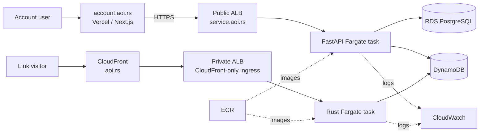

# Deployment

Terraform describes a production topology across Vercel and AWS `us-east-1`. Public API traffic and CDN-origin redirect traffic have separate routes while sharing an ECS cluster and DynamoDB.

## Account and API path

Vercel hosts Next.js at `account.aoi.rs` and injects `NEXT_PUBLIC_API_BASE_URL=https://service.aoi.rs`. The service hostname resolves to an internet-facing ALB. Port 80 redirects to HTTPS; port 443 terminates TLS and forwards to FastAPI on port 10000.

RDS is not public. It occupies private subnets and accepts PostgreSQL traffic only from the API task security group. Credentials and service secrets enter the task as environment settings managed through Terraform variables. CORS and cookie domains are independently set for the account application.

## Redirect path

The apex `aoi.rs` aliases CloudFront. CloudFront uses a VPC origin connected to an internal ALB, which forwards to Rust on port 12000. The ALB accepts HTTPS only from the AWS-managed CloudFront origin-facing prefix list.

On a miss, the redirector queries DynamoDB's `link_destinations` GSI and returns a permanent redirect with an immutable one-year cache header. The CloudFront cache key excludes cookies, headers, and query strings. Every request for a path can share a response because destination and slug are immutable.

The current viewer policy allows HTTP and HTTPS; TLS is configured through ACM, but viewer-side HTTP-to-HTTPS redirection is not asserted by the repository.

## Compute and networking

FastAPI and the redirector are independent ECS/Fargate services with separate task definitions and target groups. Terraform currently represents one task each at 256 CPU units and 512 MiB memory. This is a baseline, not a claim of autoscaling or multi-task availability.

API and redirector tasks use public subnets with public IP assignment for egress, but container ingress is restricted to their ALBs. RDS and the redirect ALB use private subnets. Security groups express ALB-to-task and task-to-database relationships.

The ECS task role permits required DynamoDB operations on links, indexes, and the counter. The execution role pulls ECR images and writes CloudWatch logs. Both services use separate log stream prefixes.

## DNS and TLS

Vercel DNS manages:

- the Vercel project domain `account.aoi.rs`;
- a `service` CNAME to the public ALB;
- an apex ALIAS to CloudFront;
- Amazon CAA and ACM validation records.

An ACM certificate covers the apex and service/load-balancer names and is used by ALB and CloudFront. The global Terraform stack represents HCP Terraform projects and sensitive production variable sets.

## Data services

- **RDS PostgreSQL 18** stores account/authentication state. The checked-in small instance and `skip_final_snapshot` setting describe the current infrastructure, not a broad durability guarantee.
- **DynamoDB on-demand tables** store links and the global slug counter, avoiding predeclared capacity for uneven growth.
- **CloudFront** is the redirect read-through cache; there is no separate application cache on misses.

## Build and release

GitHub Actions detects changed paths and builds FastAPI and Rust images independently. It pushes to separate ECR repositories using GitHub OIDC rather than static AWS credentials. Releases render task definitions with image digests and wait for ECS stability.

When migrations change, Alembic runs as a one-off Fargate task before API deployment. The web app deploys through Vercel and is promoted after the service release dependency. Terraform has formatting/validation checks; the application exposes Ruff, Pyright, Biome, TypeScript, Rust, and build checks.

Terraform reads each currently deployed container definition before defining the task. This avoids an infrastructure apply rolling application images backward: CI/CD owns image versions, while Terraform owns surrounding task configuration.

## Configuration boundaries

Application settings use the `AOI_` prefix. Local development uses `.env` and Docker Compose; production values come from ECS and Vercel configuration. AWS SDK credentials come from the task role in production and local variables for DynamoDB Local. Template env files document names without acting as production secret stores.

See [Architecture](architecture.md) for the workload split and [Data model](data-model.md) for store selection.
