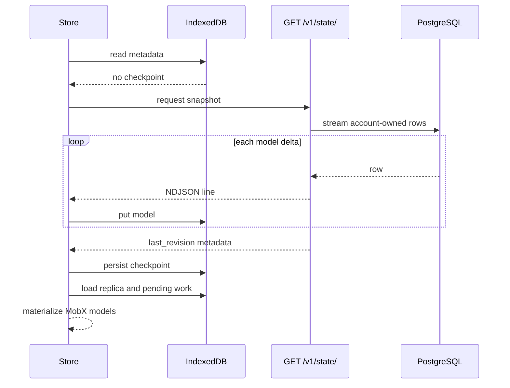
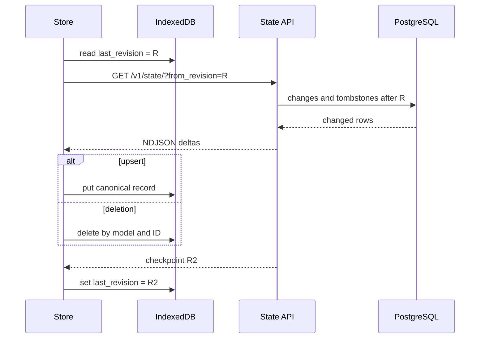
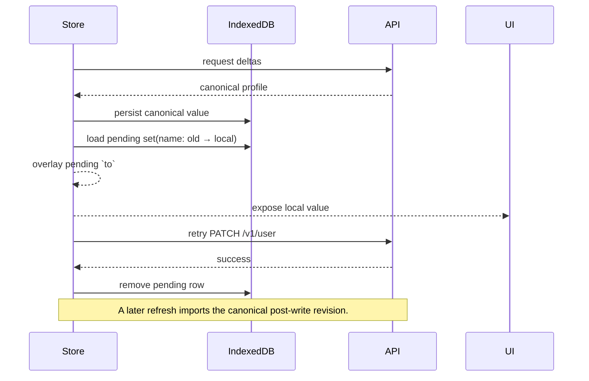

# Sync engine

The sync engine maintains a browser-resident replica of account data so UI reads do not depend on component-level request chains. Its unit is the authenticated account, currently covering the profile, sessions, and personal access tokens. Links are not part of this replica.

## Responsibilities

| Layer | Responsibility |
| --- | --- |
| PostgreSQL | Authoritative account records and deletion history |
| `/v1/state/` | Account snapshot or revision delta stream |
| NDJSON reader | Incremental parsing with bounded buffering |
| Dexie/IndexedDB | Durable replica, checkpoint, and pending mutations |
| MobX models | Observable in-memory projection for React |
| Scheduler | Durable local intent and API execution |

## Delta protocol

Each response line is independent JSON. Model deltas carry `_model` and public fields; deletions add `deleted: true`; the final metadata record carries the checkpoint.

```json
{"_model":"session","id":"...","name":"Firefox on Linux","created_at":"..."}
{"_model":"personal_access_token","id":"...","deleted":true}
{"_metadata":{"last_revision":1842}}
```

NDJSON lets FastAPI stream rows as PostgreSQL yields them and lets the browser apply records without waiting for one large document. It is not a live subscription: synchronization currently runs when the store initializes.

The checkpoint is written only when the metadata record arrives. An interrupted response may have applied some idempotent puts/deletes while retaining the old checkpoint; retrying safely reapplies that range. Advancing progress last is the central crash-recovery invariant.

## Initial synchronization



The profile is stored under local key `@me`; sessions and tokens retain server UUIDs. The server calculates the snapshot checkpoint as the greatest revision represented. The protocol requires revisions to form a safe, monotonically advancing order of committed changes; the allocator is not part of the public contract.

## Incremental synchronization



A revision cursor avoids clock synchronization and spans multiple model types. Hard deletes require explicit history because an absent row cannot appear in an incremental query. PostgreSQL deletion triggers therefore insert `(model_name, model_id, revision)` tombstones for sessions and personal access tokens.

## Reconciliation with pending work

Server deltas refresh the durable base before the queue is loaded. Pending operations then resume, and supported intent is projected over that base before rendering.



The explicit overlay currently handles pending profile `set` operations. The transaction representation supports add, set, and delete, but optimistic projection for every action and model is still evolving. This is a durable local-first foundation, not a general multi-master conflict-resolution engine.

## Guarantees and limitations

### Intended invariants

- The checkpoint advances only after streamed model operations are consumed.
- Reapplying a delta is safe because records use stable keys and deletes are key-based.
- Pending mutations are stored before network execution and survive restart.
- Server state remains authoritative; the queue represents unapplied intent.
- Tombstones make hard deletes observable to existing replicas.

### Conflict and recovery behavior

There is no compare-and-swap precondition. Mutable fields have last successful server write semantics. A local `set` records `from` and `to`, but `from` is not sent as an HTTP precondition, so concurrent devices can overwrite one another.

Failed requests leave their rows in IndexedDB, but the scheduler does not yet implement backoff, error classification, or an online-event retry loop; a later initialization or future scheduling work is needed. Model writes and checkpoint updates are separate IndexedDB operations rather than one atomic transaction. Keeping the old checkpoint until metadata makes replay safe, but an in-progress refresh is not an atomic snapshot.

The current PostgreSQL sequence allocator can assign revisions in an order different from transaction commits. It is scheduled for replacement with an ordering mechanism that cannot let a checkpoint move past a change that becomes visible later. This is an implementation caveat, not a desired property of the protocol.

The deletion feed must also be account-scoped and revision-filtered. The current query is unfinished in this respect; the intended contract is that a client sees only its own tombstones newer than its checkpoint.
