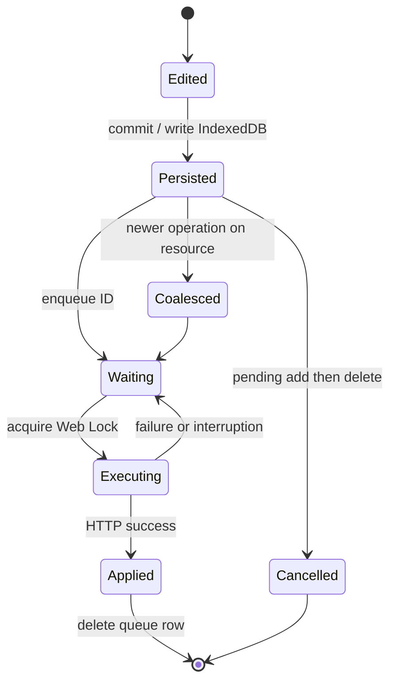

# Client transaction system

The transaction system turns a UI mutation into durable intent before attempting the network. It addresses reloads, suspended or duplicated tabs, transient failures, and repeated edits while an earlier request is pending.

## Representation

Pending operations live in IndexedDB's `_transactions` table with an auto-incrementing local ID, timestamp, model class, and optional model ID.

- `add` contains complete proposed data; the server ID is not known yet.
- `set` contains field-level `{from, to}` pairs.
- `del` contains an existing model identity.

Decorators declare model fields, mutable fields, and HTTP routes. Each MobX model retains a baseline. `diff()` compares mutable values with it; `commit()` schedules changed fields and then advances the in-memory baseline. The intended UI contract is: mutate an observable property, call `commit`, and let the runtime persist and deliver it.

## Lifecycle

Persistence precedes execution: once scheduling completes, reload cannot silently discard the mutation. Startup loads pending rows, seeds the scheduler, and flushes them.

## Coalescing

The `[model_class+model_id]` index finds pending work for the same resource.

| Existing | New | Effective operation |
| --- | --- | --- |
| `add` | `set` | Fold values into creation payload |
| `set` | `set` | Keep original `from`, replace latest `to` |
| `add` | `del` | Remove add; no request needed |
| `set` | `del` | Replace update with deletion |
| `del` | mutation | Reject: deleted models cannot be mutated |

This reduces requests and preserves a meaningful baseline. Because only `to` is currently sent, `from` supports local reasoning and future optimistic concurrency rather than conflict detection today.

## Concurrency model

An in-memory `Set` tracks scheduled local IDs. More importantly, `navigator.locks` acquires `transaction:<id>` before executing or rewriting a row. Web Locks are origin-wide, so tabs sharing IndexedDB cannot execute the same row simultaneously. The lock covers the read-after-lock check, HTTP request, and queue deletion; a tab with a stale view finds the row gone and exits.

Coalescing uses the same lock, preventing one tab from rewriting a row while another sends it. If the old operation already completed, the newer intent becomes a new row rather than disappearing.

Different transaction IDs use different locks and can execute concurrently. The composite index aims to keep one effective pending operation per existing resource, while repeated edits collapse into it.

## Synchronization interaction

The store refreshes its server-backed base first, then loads pending work. Pending profile edits are overlaid so an interrupted write does not appear to revert. Delivery resumes afterward; success removes the row, and a later sync imports the server revision.

This separates:

- **server state:** authoritative committed data;
- **local base:** last synchronized representation;
- **local intent:** pending operations projected over the base.

Complete projection for add/delete and all model classes is not implemented yet; the current explicit overlay is limited to profile updates.

## Failure model and limits

- Rows survive reload and failed requests because deletion follows success.
- A crash after server success but before local deletion can replay an operation.
- Patch-to-final-value and deletion can be application-idempotent; create needs an idempotency key for safe retry after an ambiguous response, which is not yet present.
- The scheduler lacks retry backoff and terminal-error policy. Durability prevents loss but does not guarantee prompt retry.
- The outbox is not a distributed transaction with the server.
- No field version reaches the API, so cross-device conflicts resolve by arrival order.

Persisting intent and serializing it removes a substantial class of tab/reload races while leaving clear extension points for idempotency keys, retry policy, and conflict preconditions.
